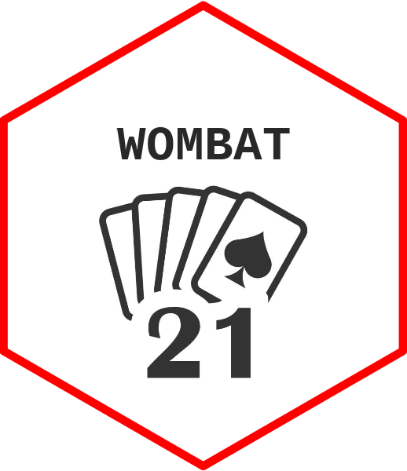

<!-- README.md is generated from README.Rmd. Please edit that file -->

```{r, include = FALSE}
knitr::opts_chunk$set(
  collapse = TRUE,
  comment = "#>",
  fig.path = "man/figures/README-",
  out.width = "100%"
)
```

# wombat21 

<!-- badges: start -->

<!-- badges: end -->

## What is wombat21?

**wombat21** is an R package that simulates a fully playable game of Blackjack (21). It supports:

-    Multiplayer (up to 6 players)

-    Computer-controlled opponents

-    Betting system with coin tracking

-    Game logic: splitting, doubling down, and insurance

-    Dealer logic (automated play)

-    Player profiles saved locally

-    Graphs for coin history and ranking

## Installation

You can install the development version of wombat21 from [GitHub](https://github.com/) with:

``` r
# install.packages("devtools")
devtools::install_github("MonashARP/game-package-wombats")
```

Then load the package:

``` r
library(wombat21)
```

## Saving Game Data

Player data (names, coin balances, history) are stored locally using `get_home_dir()`. Unique player names are enforced.
